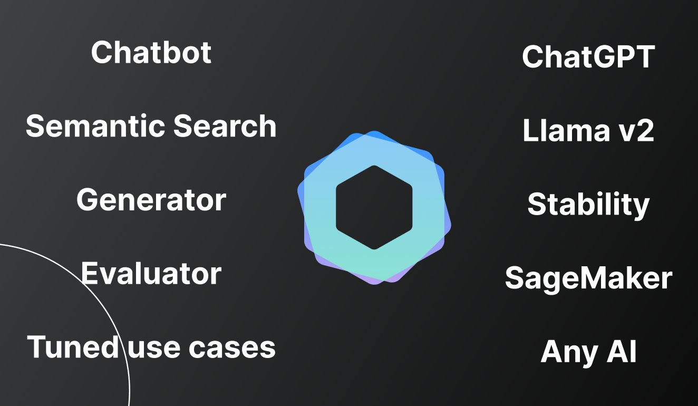

<p align="center">

</p>
<p align="center">
<a href="https://discord.gg/VYgCh2p3Ww" alt="licenses tag" target="_blank">
    
</a>

<a href="https://github.com/Hannibal046/Awesome-LLM" target="_blank">
     
</a>

</p>

# IntelliServer
AI models as private microservice - ChatGPT, Cohere, Llama, Stability, Hugging inference and more.

Intelliserver is a microservice providing unified access to multiple AI models, allowing you to easily integrate cutting-edge AI into your project.

[](https://god.gw.postman.com/run-collection/29770592-ff766d39-676e-4a6e-9a24-ad306cf69bb8?action=collection%2Ffork&source=rip_markdown&collection-url=entityId%3D29770592-ff766d39-676e-4a6e-9a24-ad306cf69bb8%26entityType%3Dcollection%26workspaceId%3D0b88b327-c88a-4050-a084-cd4486f86b68#?env%5Bintelliserver-showcase%5D=W3sia2V5IjoidXJsIiwidmFsdWUiOiIiLCJlbmFibGVkIjp0cnVlLCJ0eXBlIjoiZGVmYXVsdCIsInNlc3Npb25WYWx1ZSI6Imh0dHBzOi8vaW50ZWxsaS1zZXJ2ZXIudmVyY2VsLmFwcCIsInNlc3Npb25JbmRleCI6MH1d)

## Core Services

- **Chatbot**: chatbot functionalities using popular models like ChatGPT, Llama, and AWS Sagemaker models.
- **LLM Evaluation**: evaluate different AI models to choose the optimal solution for your requirements.
- **Semantic Search**: leverage context-aware semantic search capabilities across text documents.
- **Image Generation**: generate quality images based on described contexts using diffusion image models.
- **Chat Context**: get the relevant messages for the chatbot conversation.
- **Parsers**: convert documents to text such as PDF and word.
- **OCR**: extract text from images using AWS or Google vision.

## Installation

### Repository Setup
**npm**
```bash
cd intelliserver
npm install
npm start
```
**docker**


```bash
# docker run
docker build -t intelliserver:latest .
docker run -p 80:80 intelliserver:latest

# or docker compose run
docker-compose up
```

### Release (Docker Hub)
Pull the image
```bash
docker pull intellinode/intelliserver:latest
```
Run IntelliServer
```bash
# run with custom keys
API_KEY=<YOUR_API_KEY>
ADMIN_KEY=<YOUR_ADMIN_KEY>
docker run -p 80:80 -e API_KEY=$API_KEY -e ADMIN_KEY=$ADMIN_KEY intellinode/intelliserver:latest

# or run with the default key - only for testing
docker run -p 80:80 intellinode/intelliserver:latest
```

## Testing

To test Intelliserver, you can find the endpoints collection in the [postman repository](https://github.com/intelligentnode/IntelliServer/tree/main/postman).

Or access the swagger interactive docs: `localhost/api-docs/`

To customize the default keys and settings, create a `.env` file inside intelliserver cloned repo with the following values:
```
# api keys
API_KEY=<key>
ADMIN_KEY=<key>

# models keys - if not added, the user should send the key in the API call
OPENAI_API_KEY=<key>
AZURE_OPENAI_API_KEY=<key>
COHERE_API_KEY=<key>
GOOGLE_API_KEY=<key>
STABILITY_API_KEY=<key>
HUGGING_API_KEY=<key>
REPLICATE_API_KEY=<key>
```

## Key Benefits

- **Unified Access:** Intelliserver provides a unified API for accessing different AI models. This allows for seamless switching between models using the same endpoint format.

- **Scalability:** Intelliserver utilizes microservices architecture, allowing the AI middleware to run as an independent service with dedicated resources.

- **Model Evaluation:** Intelliserver's design allows for seamless evaluation and comparison of different AI models using unified service. This facilitates data-driven decision when selecting the optimal model for specific use cases.

## License
Intelliserver is released under the [MIT License](https://github.com/intelligentnode/IntelliServer/blob/main/LICENSE)
